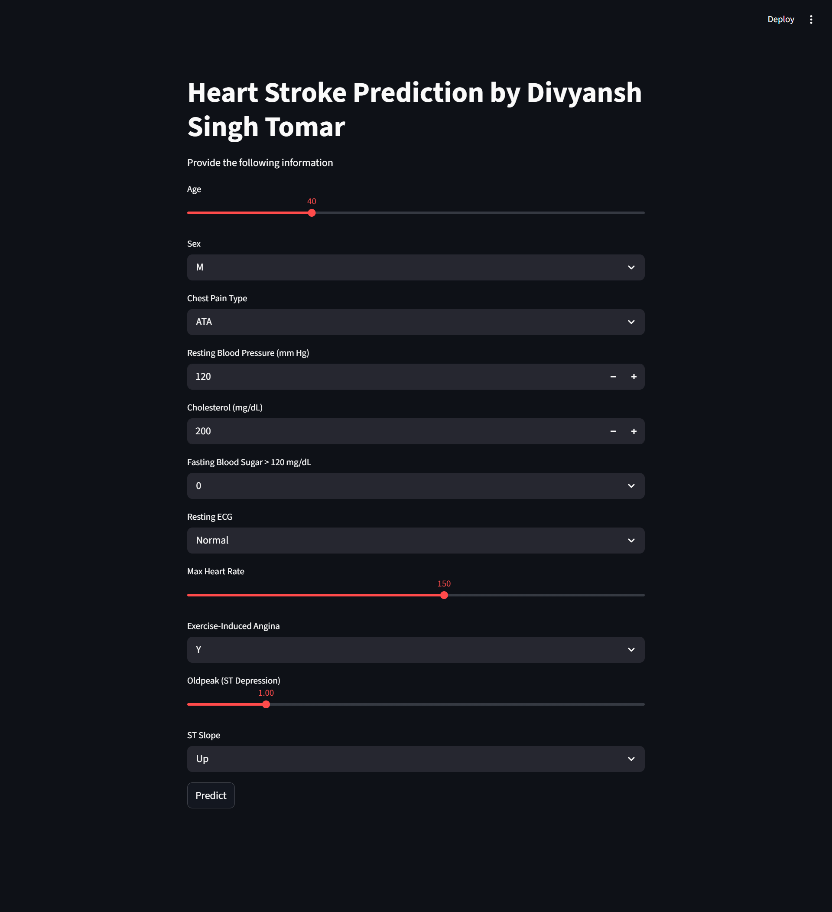

<div align="center">

# ❤️ Heart Disease Predictor

### A Machine Learning Web App to Predict the Risk of Heart Disease

[](https://python.org)
[](https://streamlit.io)
[](https://scikit-learn.org)
[](https://jupyter.org)
[](https://pandas.pydata.org)

[](https://github.com/divyanshsinghtomar-official/Heart-Disease-Predictor/stargazers)
[](https://github.com/divyanshsinghtomar-official/Heart-Disease-Predictor/forks)
[](LICENSE)
[](https://github.com/divyanshsinghtomar-official/Heart-Disease-Predictor/blob/main/main.ipynb)

---

> 🩺 **Built by Divyansh Singh Tomar** — Predicts the risk of heart disease using a K-Nearest Neighbors (KNN) classifier trained on real patient data, served through a clean and interactive Streamlit web interface.

</div>

---

## 📸 App Preview

---

## 🚀 Features

- 🧠 **KNN-based ML model** trained on a structured heart disease dataset (`heart.csv`)
- ⚡ **Interactive Streamlit web app** — no coding required to use
- 📊 **Feature scaling** using a pre-fitted `StandardScaler`
- 🎛️ Input parameters via **sliders, dropdowns, and number inputs**
- ✅ Real-time prediction with color-coded results:
  - 🔴 `⚠️ High Risk of Heart Disease`
  - 🟢 `✅ Low Risk of Heart Disease`

---

## 🗂️ Repository Structure

```
Heart-Disease-Predictor/
│
├── 📓 main.ipynb         # Jupyter Notebook: data analysis, model training & export
├── 🐍 app.py             # Streamlit web application
├── 📄 heart.csv          # Dataset used for training
├── 🤖 KNN_heart.pkl      # Saved KNN classification model
├── ⚖️  scaler.pkl         # Saved StandardScaler for input normalization
└── 🗃️  columns.pkl        # Saved feature column order for consistent prediction
```

---

## 🧪 Input Features

The app takes the following patient inputs to make a prediction:

| Feature | Type | Description |
|---|---|---|
| 🎂 **Age** | Slider (18–100) | Age of the patient |
| 🚻 **Sex** | Dropdown | M (Male) / F (Female) |
| 💢 **Chest Pain Type** | Dropdown | ATA / NAP / TA / ASY |
| 🩸 **Resting Blood Pressure** | Number (80–200 mm Hg) | Resting BP |
| 🧪 **Cholesterol** | Number (100–600 mg/dL) | Serum cholesterol |
| 🍬 **Fasting Blood Sugar** | Dropdown | 0 or 1 (>120 mg/dL) |
| 📈 **Resting ECG** | Dropdown | Normal / ST / LVH |
| 💓 **Max Heart Rate** | Slider (60–220) | Maximum heart rate achieved |
| 🏃 **Exercise-Induced Angina** | Dropdown | Y / N |
| 📉 **Oldpeak** | Slider (0.0–6.0) | ST depression induced by exercise |
| 📐 **ST Slope** | Dropdown | Up / Flat / Down |

---

## ⚙️ How It Works

```
User Input  →  One-Hot Encoding  →  Column Alignment (columns.pkl)
           →  Feature Scaling (scaler.pkl)  →  KNN Model (KNN_heart.pkl)
           →  Prediction Output (High Risk / Low Risk)
```

1. The user fills in patient details via the Streamlit UI.
2. Categorical features are one-hot encoded to match the training format.
3. Missing columns (from encoding) are filled with `0` to ensure alignment.
4. The input is scaled using the pre-fitted `StandardScaler`.
5. The KNN model predicts **1 (High Risk)** or **0 (Low Risk)**.

---

## 🛠️ Installation & Running Locally

### 1️⃣ Clone the repository

```bash
git clone https://github.com/divyanshsinghtomar-official/Heart-Disease-Predictor.git
cd Heart-Disease-Predictor
```

### 2️⃣ Install dependencies

```bash
pip install streamlit pandas scikit-learn joblib
```

### 3️⃣ Run the Streamlit app

```bash
streamlit run app.py
```

### 4️⃣ Open in browser

```
http://localhost:8501
```

---

## 📦 Dependencies

| Package | Purpose |
|---|---|
| `streamlit` | Web UI framework |
| `pandas` | Data manipulation |
| `scikit-learn` | ML model & scaler |
| `joblib` | Model serialization / loading |

---

## 📒 Notebook

The `main.ipynb` file contains the full ML pipeline:

- 📥 Data loading from `heart.csv`
- 🔍 Exploratory Data Analysis (EDA)
- 🧹 Data preprocessing & one-hot encoding
- ⚖️ Feature scaling with `StandardScaler`
- 🤖 KNN model training & evaluation
- 💾 Saving the model (`KNN_heart.pkl`), scaler (`scaler.pkl`), and column list (`columns.pkl`) using `joblib`

---

## 👤 Author

**Divyansh Singh Tomar**

[](https://github.com/divyanshsinghtomar-official)

---

## ⚠️ Disclaimer

> This application is built for **educational purposes only**. It is not a substitute for professional medical advice, diagnosis, or treatment. Always consult a qualified healthcare provider for medical concerns.

---

<div align="center">

Made with ❤️ by Divyansh Singh Tomar

⭐ If you found this useful, please consider giving it a star!

</div>